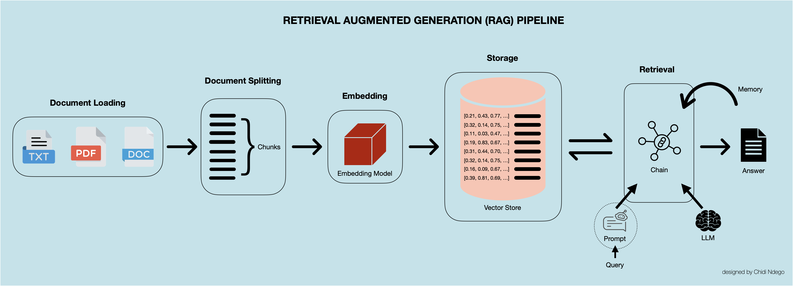

# LLM Question-Answering Application 🤖

## Description
This project leverages Large Language Models (LLMs) to offer a sophisticated question-answering system built on Streamlit. It dynamically processes uploaded documents (.pdf, .docx, .txt), extracts content, and creates embeddings to serve as the basis for generating context-aware responses to user queries.



## Features
- **Document Processing**: Supports PDF, DOCX, and TXT files.
- **Embedding Generation**: Utilizes OpenAI Embeddings for document understanding.
- **Conversational Memory**: Maintains context through *ConversationBufferMemory*.
- **Interactive UI**: Built with Streamlit for a responsive, user-friendly experience.

## Setup & Installation
1. Clone this repository
```
git clone https://github.com/ChidiNdego/llm-qna-doc-app.git
```
2. In your terminal, navigate to the repository path
```
cd llm-qna-doc-app
```
3. Install the necessary dependencies:
```
pip install -r requirements.txt
```

## How to Use
1. Start the Streamlit application:
```
streamlit run app.py
```
2. Input your [OpenAI API key](https://platform.openai.com/api-keys) in the sidebar. (If you require a test API key to access this service, please contact me using any of the links provided at the bottom of this page).
3. Upload a document.
4. Set the chunk size and number of responses, *k* (Optional).
5. Ask questions based on the document content in the provided text input field.


## Deployment

## Contact
- [LinkedIn](https://www.linkedin.com/in/chidindego)