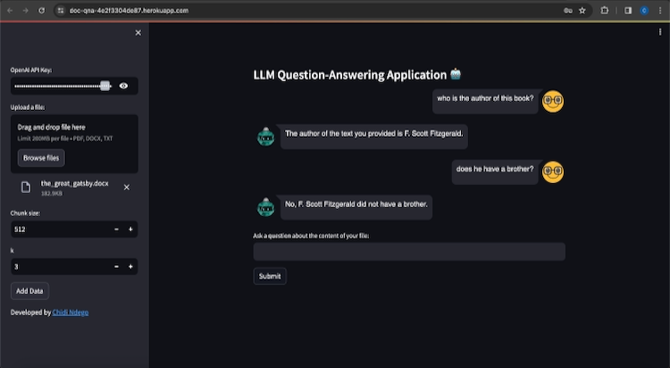
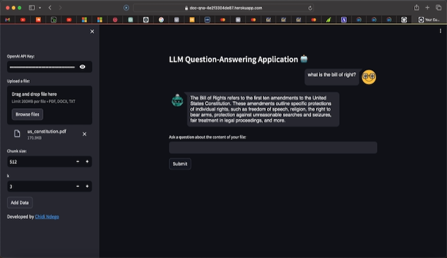

# LLM Question-Answering Application 🤖

## Description
This project leverages Large Language Models (LLMs) to offer a sophisticated question-answering system built on Streamlit. It dynamically processes uploaded documents (.pdf, .docx, .txt), extracts content, and creates embeddings to serve as the basis for generating context-aware responses to user queries.


## Features
- **Document Processing**: Supports PDF, DOCX, and TXT files.
- **Embedding Generation**: Utilizes OpenAI Embeddings for document understanding.
- **Conversational Memory**: Maintains context through *ConversationBufferMemory*.
- **Interactive UI**: Built with Streamlit for a responsive, user-friendly experience.

## Setup & Installation
1. Clone this repository
```
git clone https://github.com/ChidiNdego/llm-qna-doc-app.git
```
2. In your terminal, navigate to the repository path
```
cd llm-qna-doc-app
```
3. Install the necessary dependencies:
```
pip install -r requirements.txt
```

## How to Use
1. Start the Streamlit application:
```
streamlit run app.py
```
2. Input your [OpenAI API key](https://platform.openai.com/api-keys) in the sidebar. (If you require a test API key to access this service, please contact me using any of the links provided at the bottom of this page).
3. Upload a document.
4. Set the chunk size and number of responses, *k* (Optional).
5. Ask questions based on the document content in the provided text input field.




## Deployment
This LLM Question-Answering application is deployed using Heroku and Docker, ensuring a seamless delivery from development to production. The deployment process involves containerizing the Streamlit app with Docker, pushing the Docker image to Heroku Container Registry, and then releasing the image on a Heroku dyno. This approach guarantees the app's compatibility across different environments and simplifies updates and scalability.

To see the web app in action, visit [LLM QA App](https://doc-qna-4e2f3304de87.herokuapp.com/).



### Opportunities for Improvement
The project is open for contributions and further enhancements. Future directions could include:

- **Performance Optimization:** Refining the embedding generation and retrieval process to enhance response times.
- **Feature Expansion:** Introducing support for more file formats and richer user interactions.
- **Scalability:** Implementing advanced caching mechanisms and optimizing resource utilization for scalability.
- **User Experience:** Further improving the UI/UX design for an even more intuitive and engaging user experience.

Your feedback and contributions are welcome! Feel free to fork this project or reach out through the contacts provided below.

## Contacts
- [LinkedIn](https://www.linkedin.com/in/chidindego)
- [Email](mailto:chidindego@gmail.com)
- [Twitter](https://twitter.com/SoyChidi)
